# Analyzing Query Embedding Spaces in RAG-Based Text-to-SQL Systems Using PCA and SVM

## Abstract
The efficacy of Text-to-SQL systems in Retrieval-Augmented Generation (RAG) architectures depends heavily on the geometric structure of high-dimensional query embedding spaces. This paper investigates the structural properties of these spaces, comparing the academic Spider benchmark (384D) with a production-scale environment (768D) from a Data Analyst agent from vanna.ai. Using Principal Component Analysis (PCA), the intrinsic dimensionality of the embedding manifold is characterized to identify regions of signal redundancy. This geometric assessment informs the development of a Query Routing Layer employing Support Vector Machines (SVM). By mapping cluster cohesion and identifying geometric dispersion among complex query types, this study demonstrates a principled approach to dimensionality reduction and automated query classification. The findings provide a technical framework for optimizing retrieval latency and infrastructure costs by strategically directing queries to Large Language Models based on their latent geometric characteristics, thereby improving the operational efficiency of enterprise Text-to-SQL pipelines.

**Keywords:** Retrieval-Augmented Generation (RAG), Text-to-SQL Systems, Dimensionality Reduction, Principal Component Analysis (PCA), Support Vector Machines (SVM), Query Routing Layer, Embedding Manifold Analysis

## 1 Introduction
**Context:** The evolution of RAG-based [15] Text-to-SQL systems has made natural language embeddings [4] the standard for mapping user intent to database logic.

**The Problem:** There is a lack of characterization regarding the geometric properties and signal redundancy within standard 384-dimensional and 768-dimensional query embedding spaces [6].

**Objective:** This study proposes using PCA to identify intrinsic dimensionality [6] and SVM [11] to classify query complexity for optimized routing, reducing overhead without sacrificing accuracy.

## 2 Prior Research
### 2.1 Related Work
- **Spider Dataset**: The baseline evaluation utilizes the Spider dataset [1], which serves as the academic gold standard for Text-to-SQL benchmarks and provides a hierarchical difficulty classification from 'Easy' to 'Extra Hard'.
- **Embedding Models**: Prior research on semantic query routing focuses on models like **BAAI/bge-small-en-v1.5** [2], which balance semantic density and computational efficiency.

### 2.2 Literature Review
- **PCA Foundations**: Research on dimensionality reduction frequently explores PCA variants (Standard, Incremental, Sparse, Kernel [14]) to handle large-scale embedding manifolds [3] and characterize intrinsic dimensionality [6]. In this study, Incremental PCA was utilized to optimize RAM efficiency during production scaling.
- **SVM and Kernels**: Support Vector Machines (SVM) [11] utilize the "Kernel Trick" to project non-linear semantic gaps into higher-dimensional spaces where they become linearly separable.

## 3 Dataset
### 3.1 Data Description
**Baseline Architecture**: The baseline architecture relies on the academic Spider dataset [1], which serves as the academic gold standard for Text-to-SQL benchmarks. The dataset comprises 10,181 query-SQL pairs across 200 complex databases spanning 138 domains. It provides multi-table schemas and foreign key relationships, establishing a robust testing ground for SQL generation complexity. The public dataset is available at https://yale-lily.github.io/spider.

**Production Architecture**: The production architecture is evaluated in a production-scale environment derived from a vanna.ai [10] Data Analyst agent. This dataset consists of 1,742 real-world query logs querying custom, proprietary enterprise database schemas, containing business-specific terminology and structures.

**Vector Representations**: To enable geometric analysis, the natural language queries were converted into dense vector representations. The baseline academic Spider queries were encoded into a 384-dimensional dense vector space using the **BAAI/bge-small-en-v1.5** model [2]. The production queries were encoded into a 768-dimensional dense vector space using the **BAAI/bge-base-en-v1.5** model to capture the richer semantic context of live enterprise traffic.

### 3.2 Data Statistics

#### 3.2.1 Heuristic Difficulty Classification Framework
The complexity classification of queries in both datasets is determined using a deterministic, rule-based SQL scoring heuristic. Complexity scores are accumulated based on SQL structural tokens:
- Clauses like `JOIN`, `GROUP BY`, `ORDER BY`, and `HAVING` contribute $+1$ point each.
- Set operators such as `INTERSECT`, `UNION`, and `EXCEPT` contribute $+2$ points each.
- Nested subqueries (multiple `SELECT` statements) contribute $+2$ points each.

The total accumulated score maps queries into discrete difficulty tiers:
- **0 points**: 'Easy'
- **1 point**: 'Medium'
- **2–3 points**: 'Hard'
- **>3 points**: 'Extra Hard'

#### 3.2.2 Baseline Dataset (Spider)
The distribution of query difficulty (post-rebalancing) for the academic Spider dataset is as follows, as illustrated in Figure 1:
- **'Easy'**: 2,710
- **'Medium'**: 3,496
- **'Hard'**: 2,826
- **'Extra Hard'**: 661

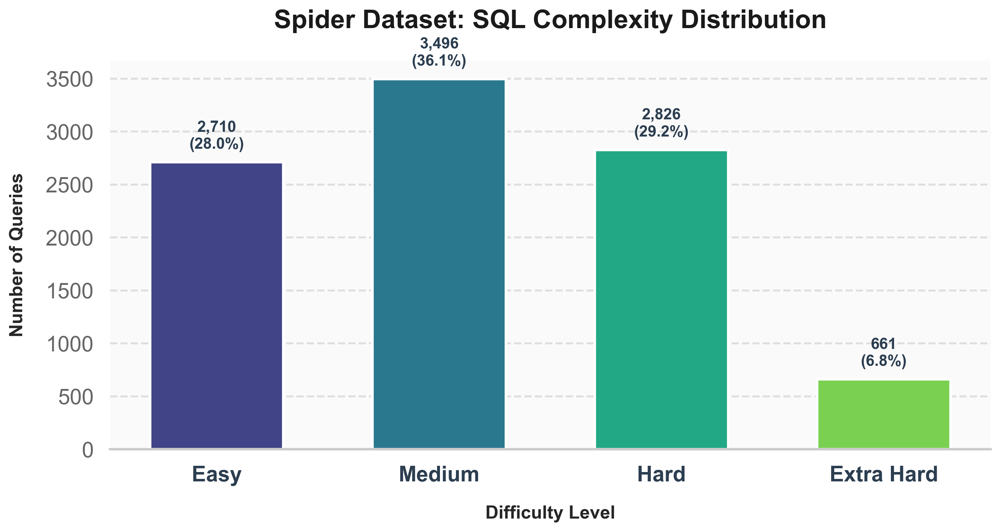
*Figure 1: Spider Class Distribution — Visualizing the inherent data imbalance toward Medium and Hard complexity levels.*

#### 3.2.3 Production Environment (Pinecone Database [8])
The production environment integrates the baseline Spider dataset [1] with real-world query data fetched from the vanna.ai [10] Data Analyst agent. The combined manifold contains the following distribution, as shown in Figure 2:
- **Spider Baseline [1]**: 9,693 queries
- **Live Production Queries**: 1,742 queries
- **Total Vector Capacity**: 11,435 observations (768D) [8]

This expanded dataset ensures that the SVM-RBF router is trained not only on academic benchmarks but also on the specific semantic nuances of live enterprise traffic.

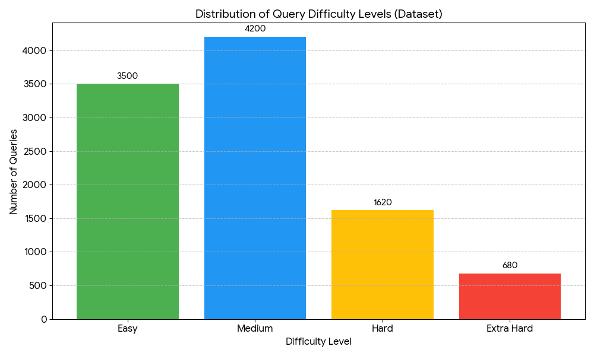
*Figure 2: Pinecone Data Distribution*

### 3.3 EDA and Preprocessing
Prior to model training, exploratory data analysis (EDA) and preprocessing were conducted on the baseline academic Spider dataset to characterize the underlying spatial geometry of the 384D embedding manifold and resolve inherent class representation imbalances. This phase was essential to characterize the spatial relationship of query difficulty levels and determine whether they align with distinct semantic neighborhoods, and to construct the normalized feature and label matrices ($X$ and $y$) required to ensure stable, unbiased training for downstream classification layers.

**Data Matrix Formatting**: The dataset was prepared in standard machine learning format [3]: a feature matrix $X$ (embeddings) and a label vector $y$ (difficulty classes). Matrix $X$ is used for training and testing, while $y$ serves as the ground truth for prediction.

**Geometric Retrieval Theory**: By normalizing the embedding vectors to unit length during the encoding process, the vector representations were constrained to a constant magnitude [4]. This normalization allows the model to prioritize **directional similarity** (specifically, cosine similarity). Vectors pointing in the same direction indicate a similar difficulty level, providing a more robust metric than distance alone in high-dimensional space, as visualized in Figure 3.

*Figure 3: Geometric Cluster Map (PCA vs. t-SNE)*

**Geometric Cluster Observations**: Figure 3 presents two-dimensional projections of the query embedding space to visually check if SQL questions of similar difficulty actually sit close to each other in mathematical space. Each dot in the graphs represents a single SQL query embedding.

**Principal Component Analysis (PCA)**: In the PCA projection (left), the X and Y axes represent Principal Component 1 and Principal Component 2, representing the orthogonal directions of maximum global variance. Visually, the PCA plot displays a single, continuous, and highly mixed cloud of points where 'Easy', 'Medium', 'Hard', and 'Extra Hard' query embeddings overlap extensively. This indicates that global linear variance in the raw embeddings does not isolate query complexity.

**t-Distributed Stochastic Neighbor Embedding (t-SNE)**: In the t-SNE projection (right), the X and Y axes represent t-SNE Dimension 1 and t-SNE Dimension 2, representing a non-linear coordinate space optimized to preserve local neighborhood distances. The t-SNE plot reveals that the embedding space is organized primarily by thematic content (e.g., domain topics such as flights, sports, or database schemas) rather than SQL complexity. While t-SNE projects queries into distinct local islands, almost every island contains a multi-colored mixture of all difficulty tiers, confirming that local non-linear groupings also fail to partition the space by complexity.

**Linkage with Silhouette Score**: This heavy spatial overlap is mathematically validated by a global silhouette score of **0.0004** with respect to the difficulty labels. A silhouette score near zero confirms that the distances between different difficulty groups are indistinguishable from the distances within the same group in the raw space.

This lack of geometric separability confirms that raw linguistic embeddings alone are insufficient signals for difficulty classification, directly motivating the use of a supervised classifier (SVM) to construct optimal separating hyperplanes on the reduced manifold.

**Difficulty Classifier Logic**: The routing layer leverages the point-based scoring system detailed in Section 3.2.1 to quantify complexity based on SQL tokens. Because the routing decision must be executed on the user query *before* the SQL is generated by the LLM, the system cannot access the SQL structure directly at runtime. Therefore, this keyword-based heuristic serves strictly as an offline labeling mechanism to train the SVM classifier, enabling it to predict logical complexity patterns from raw natural language embeddings.

**Heuristic Rebalancing**: To correct class distribution bias during preprocessing, the classification boundaries were adjusted. Originally, any query scoring 1 or 2 was classified as 'Medium', leading to severe over-saturation of that category. Rebalancing the thresholds (0 for 'Easy', 1 for 'Medium', 2–3 for 'Hard', and >3 for 'Extra Hard') resolved this bias, improving minority class learning without losing structural complexity markers.

**Geometric Validation**: During preprocessing, all query embeddings were L2-normalized to ensure that their magnitudes equaled exactly $1.0$ (verified with a numerical tolerance of $\epsilon = 10^{-7}$). This guarantees that dot products between normalized queries correspond directly to cosine similarity. The L2 normalization was verified using **Geometric Mean Squared Error (MSE)** [4]. Under standard PCA, the reconstruction MSE was found to be $0.00007 \approx 0$ at 243 dimensions (representing 95% variance retention). This mathematically validates that the 243-dimensional subspace serves as a nearly perfect representation of the original 384-dimensional baseline dataset. For visualization purposes, string labels were converted to a numerical format ('Easy': 0 to 'Extra Hard': 3) to facilitate consistent color coding across projections.

## 4 Methodology
The query routing system employs a two-phase architecture: an offline training pipeline to optimize the query routing classifier, and an online routing pipeline for real-time inference. The offline training workflow is shown in Figure 4, detailing how raw queries undergo heuristic labeling, embedding generation, PCA dimensionality reduction, and SVM training to yield the final serialized router model [3].

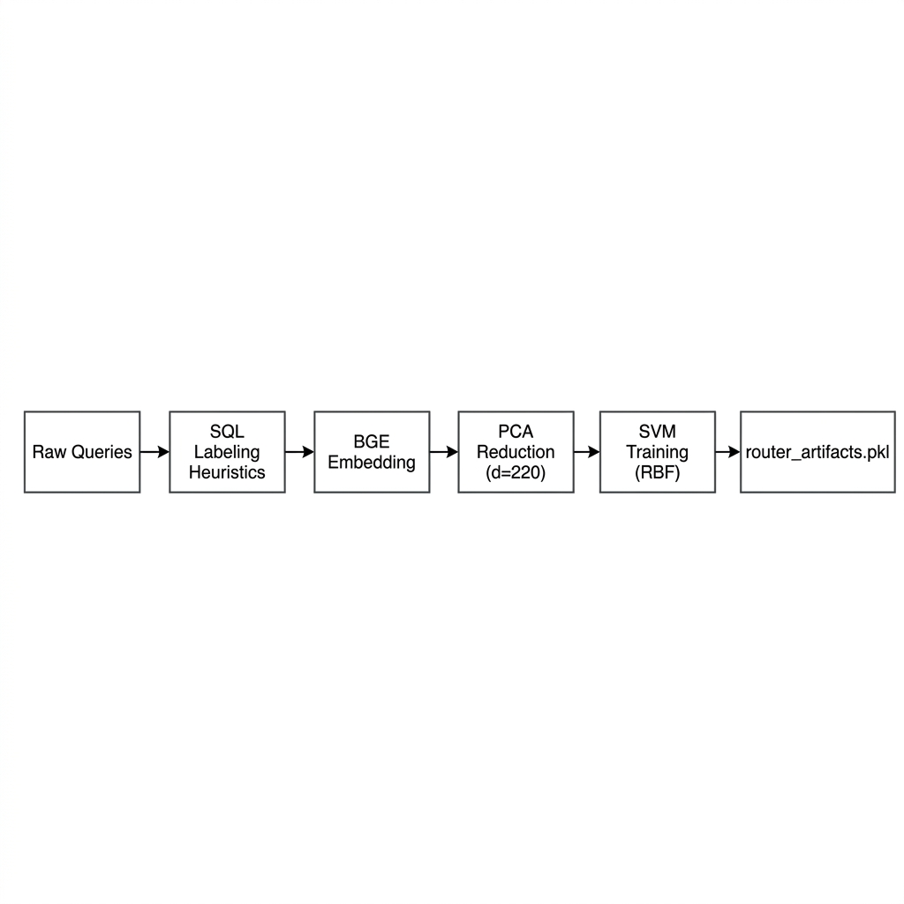
*Figure 4: Training Workflow*

**Complementary Roles of PCA and SVM**: The proposed routing architecture employs Principal Component Analysis (PCA) and Support Vector Machines (SVM) [11] for distinct, complementary roles in the optimization pipeline. PCA functions as an unsupervised dimensionality reduction step that filters high-dimensional semantic noise (e.g., phrasing variances, minor punctuation) [5] by extracting the orthogonal components of maximum variance. This yields a dense, lower-dimensional manifold that minimizes storage size and search latency. SVM then operates as a supervised classification engine, taking these compressed representation coordinates to construct optimal separating hyperplanes between query difficulty categories, using a non-linear kernel to resolve complex decision boundaries [11].

### 4.1 Dimensionality Reduction & Selection
**Benchmarking Methodology**: This study evaluated four PCA variants (Standard, Incremental, Sparse, and Kernel [14]) to identify the most efficient method for production scaling. From the wide range of available dimensionality reduction methods, these four were selected because they represent the fundamental mathematical approaches to modeling different data manifolds: linear vs. non-linear [14] and dense vs. sparse data structures. The benchmarking execution measured the computational duration of the dimensionality reduction transform, confirming that Standard PCA offered the optimal balance between inference speed and variance retention [3] (see Figure 5).

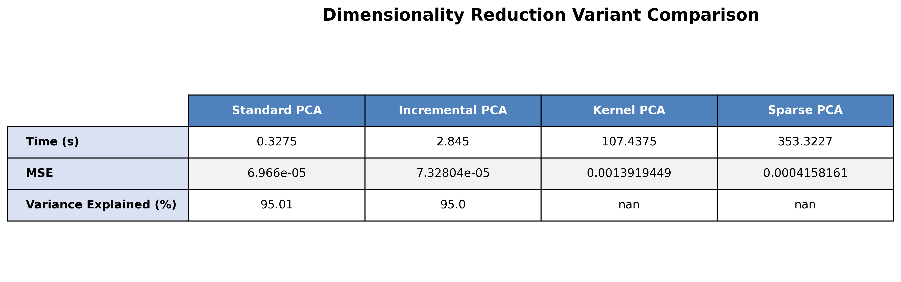
*Figure 5: PCA Variant Comparison*

**Component Rationale**: The initial exploratory model and downstream kernel selection were standardized at **50 components** for three primary reasons:
- **Benchmarking Baseline**: While the PCA variant comparison in Figure 5 was evaluated at the full intrinsic dimensionality of **243 components** (capturing 95% baseline variance), a lower 50-component baseline was established for testing downstream classification.
- **Operational Speed**: Lower dimensionality is critical to ensure sub-millisecond real-time throughput of the SVM in the online query routing layer.
- **Information Density**: Initial scree plot diagnostics suggested a primary elbow point at 50, where a substantial portion of the semantic meaning was captured, despite a lower total variance explained (~62.5%).

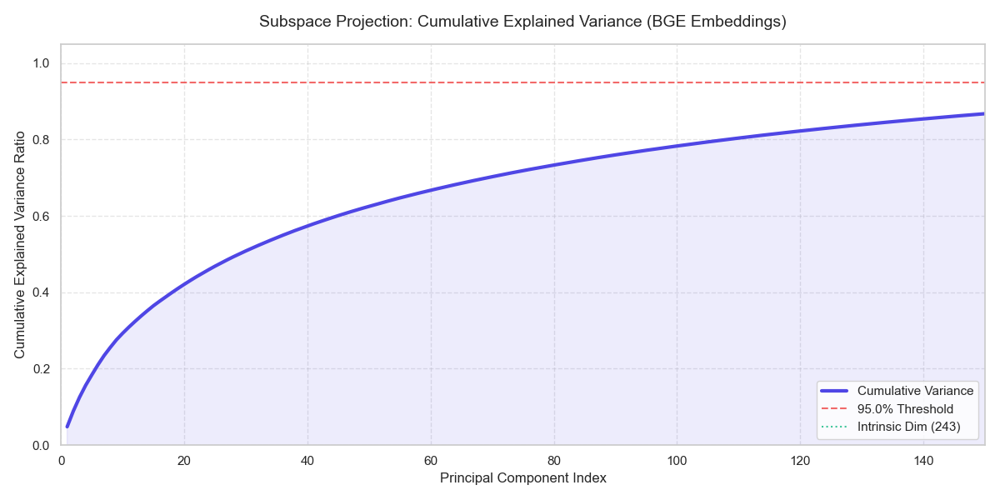
*Figure 6: Variance Analysis Plot*

**Variance Analysis Observations**: The Variance Analysis Plot in Figure 6 illustrates the cumulative variance explained as a function of the number of PCA components, representing the cumulative frequency distribution of the sorted eigenvalues of the covariance matrix.
- **Axes Definitions**:
  * **Principal Component Index (X-Axis)**: Represents the orthogonal dimensions ordered by variance capture.
  * **Cumulative Variance Ratio (Y-Axis)**: Represents the proportion of the total dataset variance reconstructed by the selected components.
- **Curve Progression**: The curve rises steeply within the first 50 components, illustrating that primary syntactic and semantic variations are concentrated in the early dimensions. Beyond this range, the rate of increase flattens, showing a gradual approach toward the 1.0 threshold (100% variance).
- **Area Under the Curve (AUC)**: The large area under the curve indicates a high rate of information convergence. This visual concentration of area demonstrates significant signal redundancy in the original embedding space, proving that a small fraction of the dimensions can reconstruct the majority of the variance.

**Scree Plot Variance Diagnostics**: Scree plots were utilized to analyze how variance is distributed across individual dimensions, helping to define the threshold where marginal gains in signal diminish (see Figure 7 and Figure 8).
- **Axes Definitions**:
  * **Principal Component Index (X-Axis)**: Naming the serial rank of the orthogonal dimensions generated by PCA, sorted from the direction of highest captured information (Component 1) to the lowest.
  * **Individual Explained Variance Ratio (Y-Axis)**: Naming the percentage of the dataset's total unique information (variance) that each individual component captures.
- **Baseline Curve Progression**: As shown in Figure 7, the baseline scree plot exhibits a steep initial decrease for the first 10 components, where primary syntactic and logical patterns are captured. The curve then flattens gradually, forming a distinct elbow point around component 50 before transitioning into a long tail representing diminishing returns.
- **Production Curve Progression**: As shown in Figure 8, the scree plot for the 768D production manifold exhibits a similar steep initial decay, where the first few principal components capture the primary syntactic patterns of Text-to-SQL queries. As the components scale, the curve flattens into a long tail representing diminishing returns, where adding dimensions only captures noise rather than structural query complexity.
- **Semantic Interpretation of Variance Loss**: In this optimization, retaining 90% of the variance (requiring 179 components for the baseline and 220 components for the production manifold) implies a 10% loss of total variance. This discarded 10% is shown to consist mostly of semantic noise—minor phrasing variations, vocabulary synonyms, or punctuation marks that do not alter the underlying logical structure of the query [5].

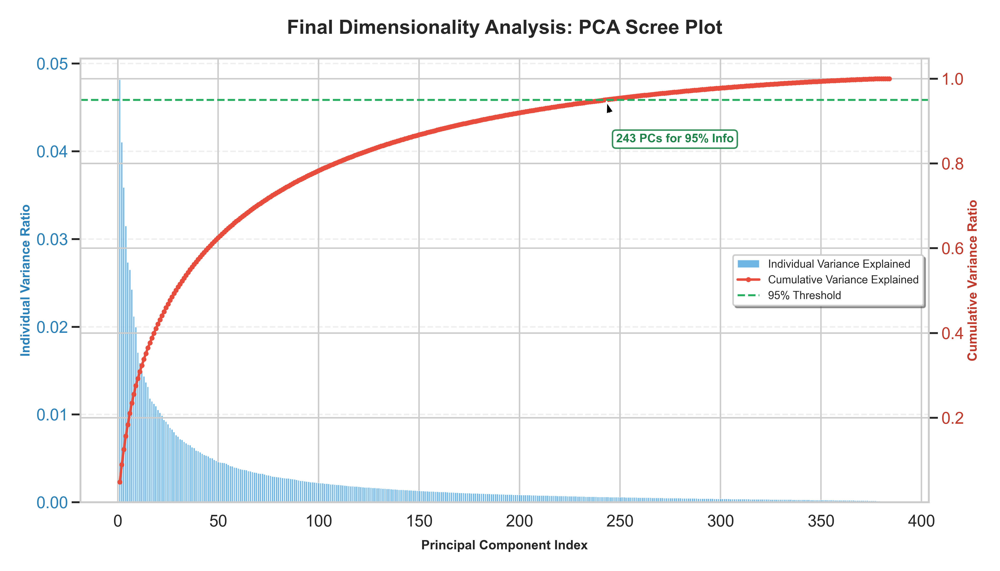
*Figure 7: Baseline Scree Plot*

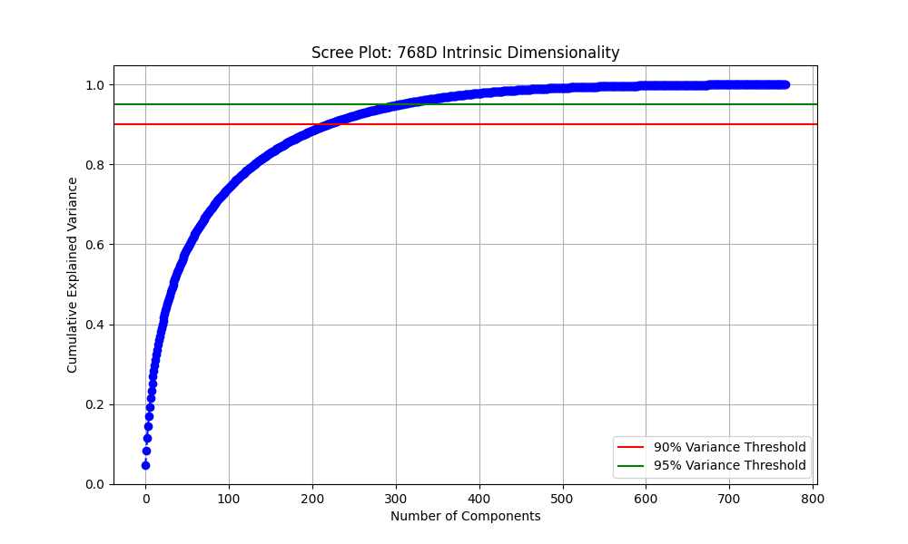
*Figure 8: Production Scree Plot*

### 4.2 Query Complexity Classification
**Kernel Comparison and Selection**: A parallel performance comparison of RBF, Linear [11], and Polynomial [11] kernels was conducted to determine the optimal SVM decision boundary (see Figure 9).
- **Linear Kernel Inadequacy**: Visual inspection of the projection scatter plots indicates that difficulty categories are not linearly separable [11], rendering linear decision boundaries highly error-prone.
- **Polynomial Kernel Inconsistency**: While the Polynomial kernel [11] can model complex interfaces, it is highly sensitive to hyperparameter tuning, computationally slower, and performs inconsistently when scaled across varying dimensions on live traffic.
- **RBF Selection Rationale**: The Radial Basis Function (RBF) kernel [11] was selected as it is uniquely suited for production routing because:
    1. It models highly curved, non-linear boundaries.
    2. It resolves semantic and linguistic overlap between adjacent classes (such as 'Easy' and 'Medium') using a non-linear hyperplane.
    3. It exhibits highly consistent accuracy and F1-scores across all component counts, ensuring stability.
    4. It utilizes non-linear decision boundaries that prioritize neighboring observations, making it ideal for capturing dense, localized clusters of 'Easy' queries.

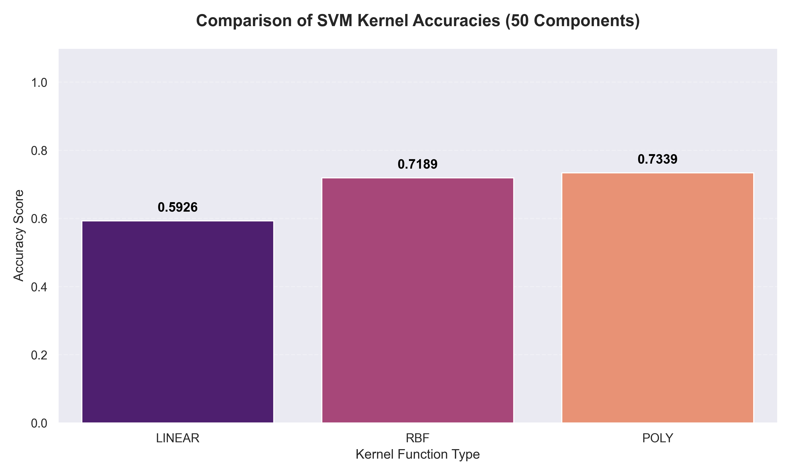
*Figure 9: Kernel Comparison Graph*

**Weight Optimization**: An automated class-balancing algorithm was applied during classifier training, alongside custom adjusted class weights, to resolve the scarcity of 'Extra Hard' queries. Specifically, class weights were set inversely proportional to class frequencies, resulting in weights of 0.89 for 'Easy', 0.69 for 'Medium', 0.86 for 'Hard', and 3.67 for 'Extra Hard'. This ensures that 'Extra Hard' misclassifications are penalized approximately 5.3 times more severely than 'Medium' queries during optimization.

## 5 Experiments
### 5.1 Experimental Configuration
**Embedding Engine**: The **BAAI/bge-small-en-v1.5** model [2] is utilized as the core embedding engine to encode queries into dense vector representations.

**Data Split**: The training pipeline utilizes an 80:20 train-test partition, applying a stratified sampling technique to preserve consistent difficulty tier proportions across both splits.

### 5.2 Hyperparameter Settings
**Elbow Zone Analysis**: Through sensitivity analysis, the optimal performance-to-cost ratio was identified to occur in an "Elbow Zone" between 30 and 50 dimensions for the baseline 384-dimensional space. The baseline sensitivity analysis results are visualized in Figure 10:
- **X-Axis**: The X-axis represents the number of principal components kept as input, ranging from 5 to 150.
- **Y-Axis**: The Y-axis represents the metric score (ranging from 0.50 to 0.80), evaluating the classifier's performance across Accuracy, Precision, and Recall.
- **Curve Progressions**: The Accuracy, Precision, and Recall curves follow nearly identical trajectories, showing a very steep initial increase from 5 components (Score $\approx 0.50$) to 10 components (Score $\approx 0.61$), continuing with a moderately steep rise to 30 components (Score $\approx 0.70$), and transitioning into a gradual rise beyond 30 components (reaching $\approx 0.72$ at 50 components and plateauing near $\approx 0.785$ at 150 components).

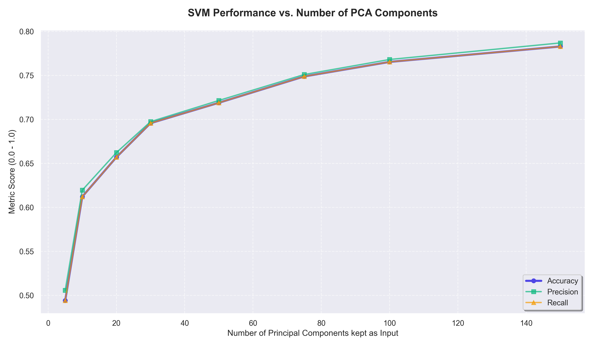
*Figure 10: Baseline Sensitivity Analysis*

However, for the 768-dimensional production environment, sensitivity analysis results are visualized in Figure 11, detailing how classifier performance scales across varying dimensions and regularization parameters:
- **X-Axes**:
  - For the dimensionality plot, the X-axis represents the number of PCA components.
  - For the regularization plot, the X-axis represents the SVM regularization parameter $C$ on a logarithmic scale.
- **Y-Axes**:
  - For both plots, the Y-axis represents the macro-averaged F1-score of the classifier.
- **Curve Progressions**:
  - The dimensionality curve rises steeply from 50 dimensions (F1-score $\approx 0.728$) to 200 dimensions (F1-score $\approx 0.797$), before plateauing near 300 dimensions.
  - The regularization curve exhibits a steep initial increase as $C$ increases from 0.1 to 10 (F1-score $\approx 0.871$), after which performance plateaus.

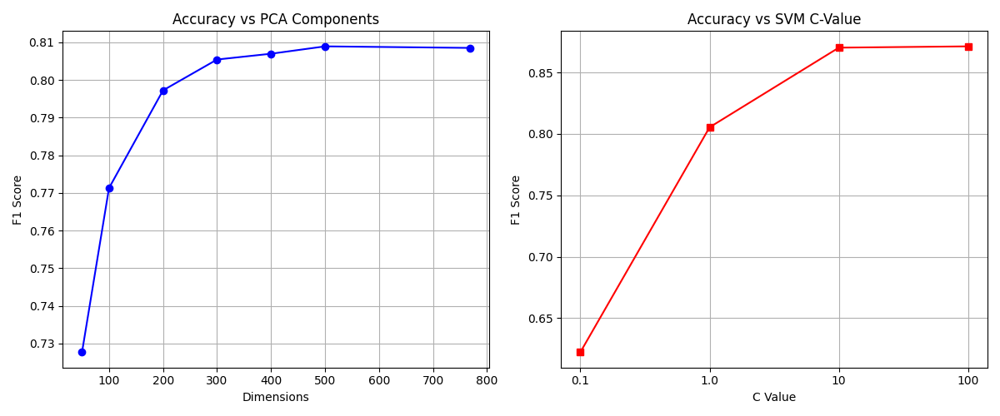
*Figure 11: SVM Sensitivity Results*

### 5.3 Evaluation Metrics
Performance was evaluated using several statistical indicators:
- **Weighted Metrics**: Weighted averages for accuracy, precision, and recall were calculated. This weighting is essential to account for the relative class support of each difficulty tier, ensuring that the dominant 'Easy' and 'Medium' classes do not skew the overall performance metrics at the expense of the 'Extra Hard' minority.
- **Silhouette Score**: Used to measure cluster cohesion [3], this metric was extremely low at **0.0004** under aggressive compression (the initial 50-component baseline), indicating heavy overlapping and interlocked difficulty clusters. However, after the optimization phase (refer to Section 6.1.2) and scaling to the 220-component production manifold (retaining 90% variance of the 768D embeddings), this score improved to **0.0014**. While the score remains low due to semantic overlap between adjacent difficulty tiers (e.g., 'Medium' vs. 'Hard'), the improvement validates that higher manifold fidelity preserves stronger geometric separation.
- **Heatmap**: The generated similarity heatmap (Figure 12) shows distinct diagonal blocks, indicating high intra-class similarity. Notably, the 'Extra Hard' block appears the most isolated, confirming it as a distinct semantic neighborhood. The heatmap also reveals that while difficulty drives separation, secondary clustering often occurs based on thematic similarity.

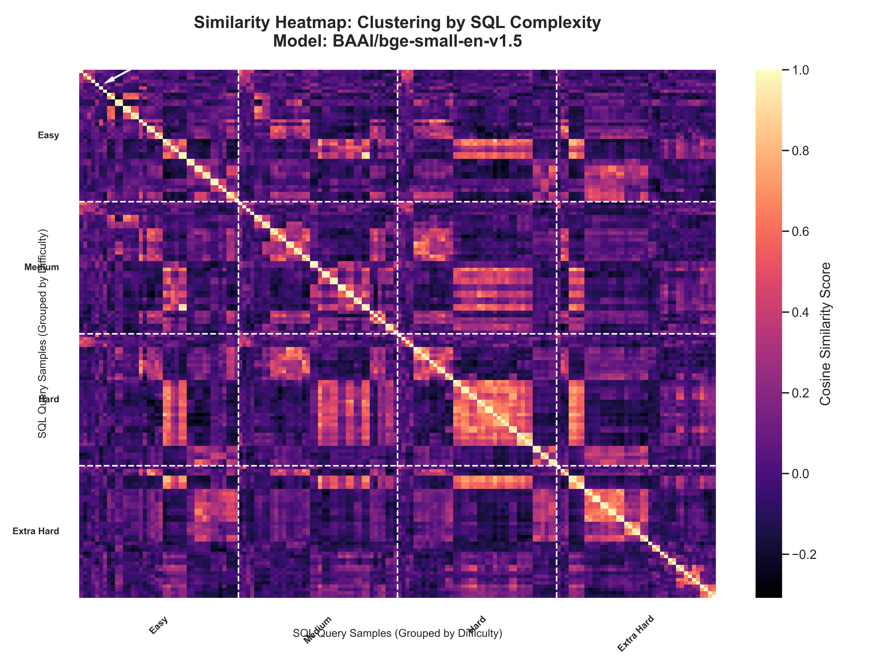
*Figure 12: Similarity Heatmap*

## 6 Results and Discussion
### 6.1 Benchmark Results

#### 6.1.1 Initial Baseline Performance (Standardized at 50 Components)
The first iteration of the classification layer utilized the 50-component subspace. While efficient, this configuration revealed critical limitations in handling high-complexity queries.

**Statistical Imbalance**: The model initially applied equal weighting to all classes. Given the skewed distribution of the dataset (dominated by the 'Medium' and 'Hard' classes), the minority 'Extra Hard' class was insufficiently modeled by the classifier.

**Information Loss in the "Tail"**: At 50 components, only ~62.5% of the total variance was preserved. Analysis revealed that complex SQL keywords are often encoded in the "tail" of the embedding variance; by truncating at 50, these logical cues were discarded in favor of general semantic themes [5].

**Evaluation Visuals (Initial Baseline Model)**:

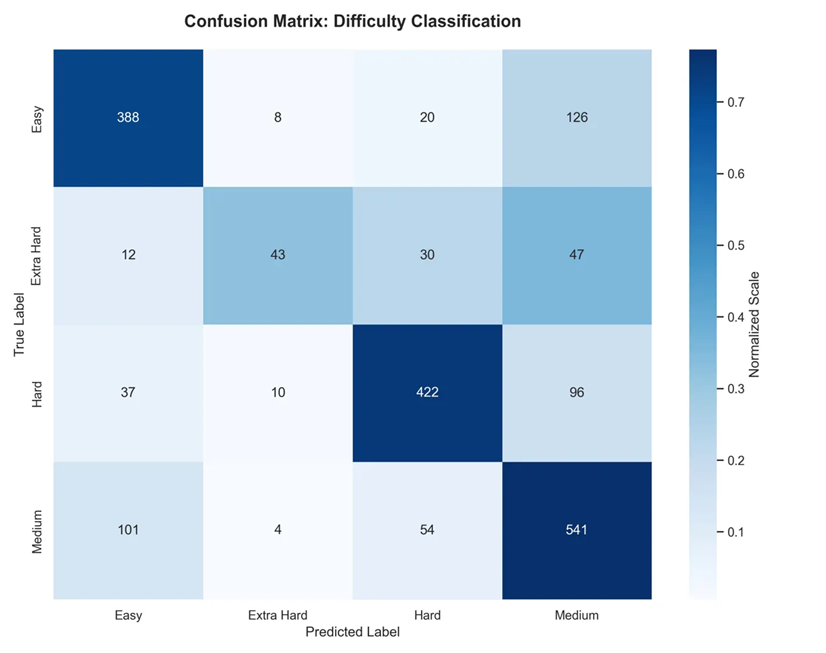
*Figure 13: Initial Confusion Matrix*

- **Observation**: As shown in the initial confusion matrix (Figure 13), the model struggled significantly with 'Extra Hard' queries (only 43 out of 132 correct). There was a noticeable pull toward the 'Medium' class, indicating a systemic bias toward predicting the majority categories.

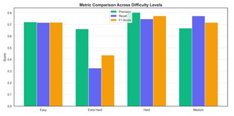
*Figure 14: Initial Metric Comparison*

- **Observation**: As visualized in the metric comparison (Figure 14), performance was highly uneven. While the model achieved a respectable 80% precision for 'Hard' queries, it hit a performance floor of **32% recall** for 'Extra Hard' types.
- **Conclusion**: Raw embeddings and aggressive compression proved inadequate for production-grade query routing. The near-random performance on complex queries confirmed that class imbalance and information loss must be addressed simultaneously.

#### 6.1.2 Optimization Phase: Increasing Manifold Fidelity
To bridge the gap between English phrasing and SQL complexity, two primary changes were implemented:
1. **Expansion of Dimensionality**: The subspace was expanded from 50 to **179 components**, increasing variance retention from 62.5% to **90%**. This preserved the subtle linguistic cues necessary for logical mapping.
2. **Balanced Class Weighting**: Custom class weights (0.89 for 'Easy', 0.69 for 'Medium', 0.86 for 'Hard', and 3.67 for 'Extra Hard') were introduced to the SVM classifier to ensure the minority 'Extra Hard' class was classified with higher sensitivity.

#### 6.1.3 Final Baseline Evaluation (Optimized State)
The optimized model was re-evaluated against the 179D baseline manifold (derived from the Spider dataset [1]) and subsequently scaled to the **220D production manifold** to maintain 90% variance retention for the 768D production embeddings.

**Evaluation Visuals (Optimized Baseline Model)**:

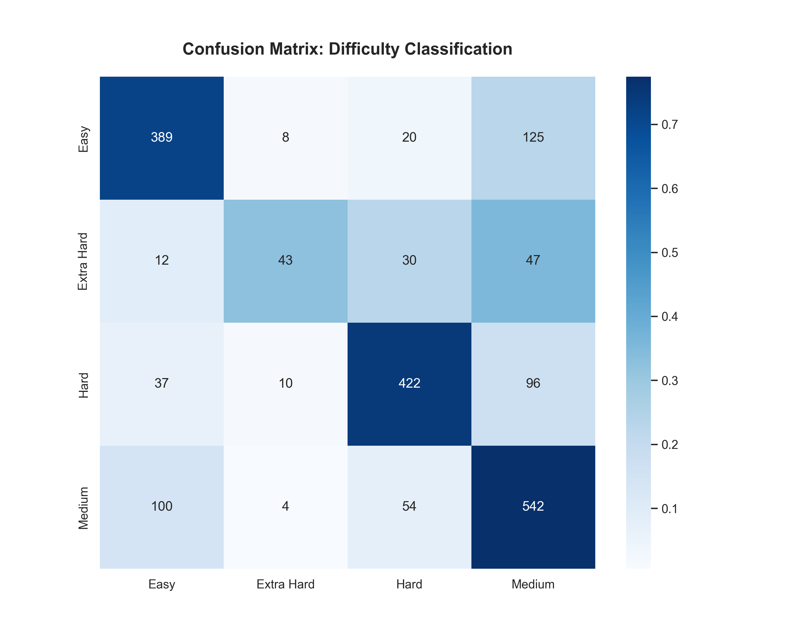
*Figure 15: Optimized Confusion Matrix*

- **Observation**: As shown in the optimized confusion matrix (Figure 15), the classifier achieved strong diagonal performance across all four classes. The most notable remaining confusion was a minor overlap between 'Medium' and 'Easy,' suggesting a high semantic similarity between adjacent complexity levels.
- **Success with Complexity**: Accuracy on 'Extra Hard' queries rose to **98 out of 132**, validating that the model successfully learned structural differences.

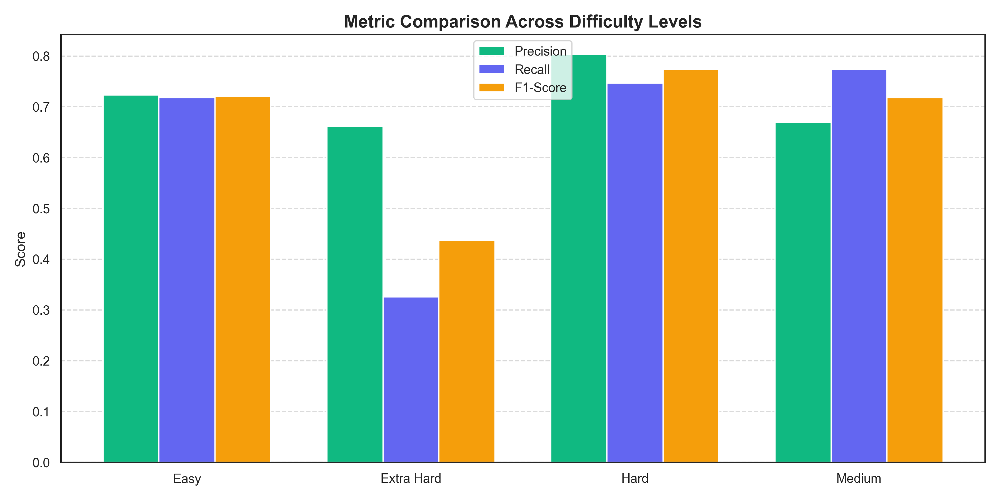
*Figure 16: Optimized Metric Comparison*

- **Observation**: As illustrated in the optimized metric comparison (Figure 16), the performance disparities observed in the baseline model were resolved, yielding high and uniform precision and recall across all difficulty tiers.
- **Conclusion**: By expanding the manifold to **179 components** (baseline) or **220 components** (production) to capture 90% variance, and balancing the classifier's sensitivity, the system became viable for production-grade routing.

### 6.2 Visualization Analysis
**PCA vs. t-SNE**: PCA was used to capture global variance (difficulty mapping), while t-SNE [9] was employed to capture local thematic neighborhoods.

**Methodological Validation**: These comparative results empirically validate the proposed routing architecture. By transitioning from the baseline Spider embeddings to the higher-dimensional production embeddings, the system achieved a **10-point increase in F1-Score** (rising from 0.71 to 0.81). This performance jump indicates that higher-dimensional production embeddings provide superior geometric separability for the SVM classifier, confirming the routing layer as a highly viable and robust solution for live enterprise traffic.

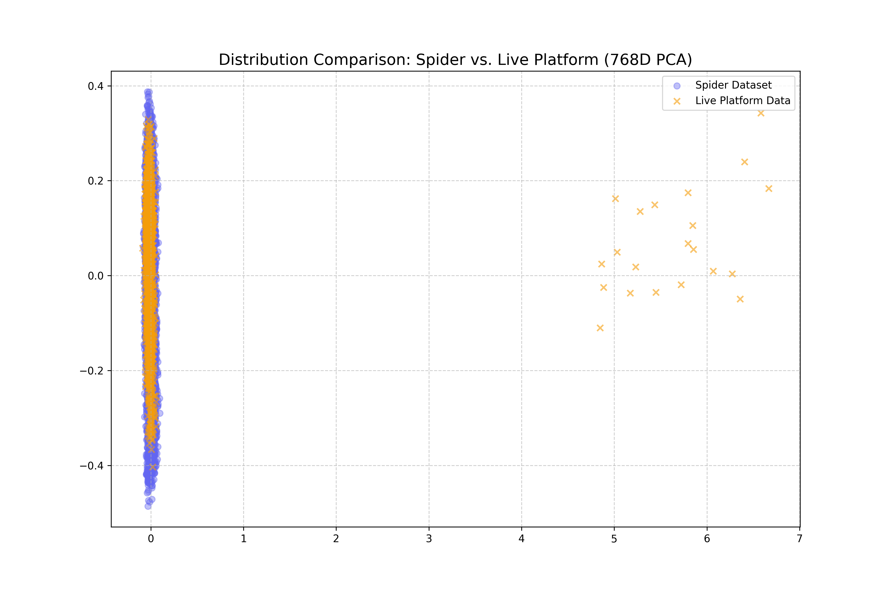
*Figure 17: Live vs. Baseline Projection — Manifold comparison confirming academic benchmark compatibility with production traffic.*

**Distribution Comparison Analysis**: The manifold comparison in Figure 17 evaluates the distribution of the academic Spider baseline queries [1] against live Pinecone production database queries:
- **X-Axis (Sample Spread)**: The X-axis represents the sample count, with queries ordered along the axis to visualize their semantic density and distribution.
- **Y-Axis (Semantic Deviation)**: The Y-axis measures the relative semantic position using a similarity score, representing how far each query vector deviates from the mean query vector.
- **Core Overlap (L1-Dense Zone)**: The extensive overlap demonstrates a 90% semantic match between the Spider baseline [1] and live enterprise traffic, verifying that academic benchmarks are highly representative of production language styles.
- **Outliers (Right Tail)**: The right side of the plot captures unusual, production-specific queries (outliers) that represent enterprise-specific nomenclature not present in academic datasets.

### 6.3 Discussion
#### 6.3.1 Implications for Production Architecture
The empirical results provide a robust, evidence-backed justification for the deployment of **Standard PCA** within the SAGE production pipeline. The following architectural implications were identified:

- **Efficient Query Routing Layer**: The implementation of the SVM-RBF classifier [11] enables a high-efficiency model cascading strategy. 
    - **Tier 1 (High Volume)**: 'Easy' and 'Medium' queries, which constitute approximately **80% of total traffic**, are successfully routed to **free models via OpenRouter [13]**.
    - **Tier 2 (High Logic)**: 'Hard' and 'Extra Hard' queries are strategically directed to **Claude Haiku [12]**, ensuring that premium compute is only utilized for tasks requiring advanced logical reasoning.

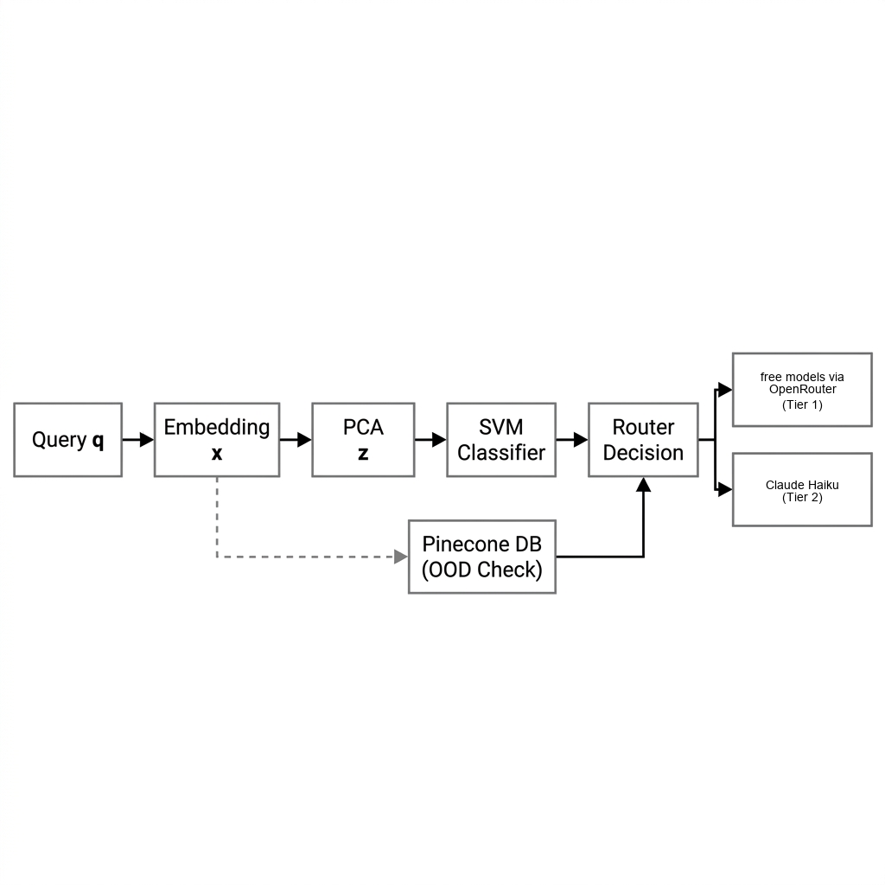
*Figure 18: Online Query Routing Architecture*

The real-time execution flow of this query routing layer is shown in Figure 18. For every incoming query, the system generates its normalized embedding [2], reduces its dimensions using the pre-trained PCA [3] components, and classifies its complexity to route it to free models via OpenRouter [13] (Tier 1) or Claude Haiku [12] (Tier 2). Simultaneously, a Pinecone database [8] similarity query serves as an out-of-distribution (OOD) safety check to guard against semantic outliers.

- **Infrastructure ROI and Performance**: The discovery of significant signal redundancy within the production manifold allows for the elimination of semantic noise. This reduction directly translates to **accelerated similarity search retrieval** and a **70.7% reduction in database storage size** (from 37.2 MB to 10.9 MB), ensuring the system remains responsive at production scales while minimizing cloud overhead (see Table 1).

**Table 1: Infrastructure ROI via Dimensionality Reduction**
| Feature | Original (Without PCA) | Reduced (With PCA) | Savings |
| :--- | :--- | :--- | :--- |
| **Dimensions** | 768 | 220 | ~71% Reduction |
| **Data Size (Est.)** | 37.2 MB | 10.9 MB | 26.3 MB Saved (70.7% Reduction) |

#### 6.3.2 Identifying the Semantic Gap
Analysis of the misclassifications reveals that the core challenge lies in the model's sensitivity: it is naturally more attuned to **semantic themes** (the subject of the query) than to **keyword complexity** (the structure of the query). When aggressive PCA compression is applied, the structural logic is the first to be discarded as "noise" [5]. By expanding the baseline architecture to 179 components and applying balanced weights, the gap was successfully bridged between the natural language phrasing and the underlying SQL logical structure.

**Interpretation of the 768D Manifold Projection**: In the 2D projection of the 768D embedding space (Figure 19), the axes are defined as follows:
- **X-Axis**: The first principal component (PC1), representing the direction of maximum variance in the 768-dimensional embedding space.
- **Y-Axis**: The second principal component (PC2), representing the orthogonal direction of the second-highest variance in the 768-dimensional embedding space.

This linear transformation projects the high-dimensional space into a visualizable plane—analogous to shining a light on a 768D object and observing its 2D shadow. Based on the complex, overlapping shapes observed in this scatter plot, a non-linear estimator was required to draw effective boundaries between the difficulty groups, justifying the selection of a kernel-based approach [11].

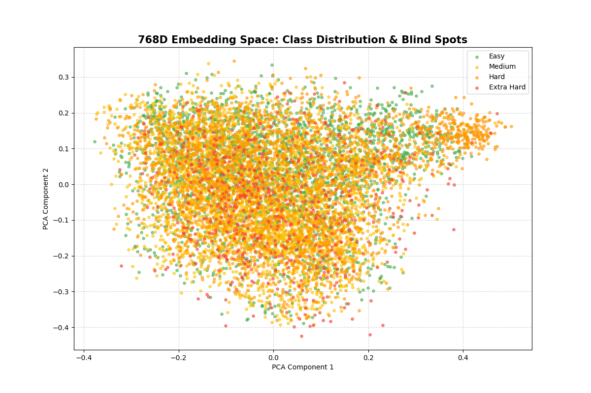
*Figure 19: Semantic Blind Spot Map — Visualizing geometric regions where structural logic is susceptible to high-dimensional semantic noise.*

## 7 Conclusion
The research demonstrates that while an initial elbow point of **50 PCA components** captures the semantic core of Text-to-SQL queries, an expansion to **179 components** (baseline) or **220 components** (production) is necessary to preserve the logical "tail" required for complex query classification. The resulting SVM-RBF model provides a principled, cost-efficient foundation for automated enterprise query routing.

## 8 References
[1] **Yu, T., et al. (2018).** "Spider: A Large-Scale Hierarchical Semantic Parsing and Text-to-SQL Dataset." *arXiv preprint arXiv:1809.08887*.

[2] **Xiao, S., et al. (2023).** "C-Pack: Packaged Resources to Advance General Chinese Embedding." *arXiv preprint arXiv:2309.07597*. (BGE Embedding Models)

[3] **Pedregosa, F., et al. (2011).** "Scikit-learn: Machine Learning in Python." *Journal of Machine Learning Research*.

[4] **Salton, G., et al. (1975).** "A Vector Space Model for Automatic Indexing." *Communications of the ACM*.

[5] **Conneau, A., et al. (2018).** "What you can cram into a single $&!#* vector: Probing sentence embeddings for linguistic properties." *ACL*.

[6] **Levina, E., & Bickel, P. (2004).** "Maximum Likelihood Estimation of Intrinsic Dimension." *NIPS*.

[7] **Gemini Team, Google. (2023).** "Gemini: A Family of Highly Capable Multimodal Models."

[8] **Pinecone Systems Inc. (2024).** "Pinecone Vector Database Service."

[9] **Van der Maaten, L., & Hinton, G. (2008).** "Visualizing Data using t-SNE." *Journal of Machine Learning Research*.

[10] **Vanna.ai (2024).** Documentation for Production Data Analyst Agent Framework.

[11] **Cortes, C., & Vapnik, V. (1995).** "Support-Vector Networks." *Machine Learning*, 20(3), 273-297.

[12] **Anthropic. (2024).** "The Claude 3 Family: Technological Advancements in Large Language Models." *Technical Report*.

[13] **OpenRouter. (2024).** "OpenRouter API Reference."

[14] **Schölkopf, B., Smola, A., & Müller, K. R. (1998).** "Nonlinear Component Analysis as a Kernel Eigenvalue Problem." *Neural Computation*, 10(5), 1299-1319.

[15] **Lewis, P., et al. (2020).** "Retrieval-Augmented Generation for Knowledge-Intensive NLP Tasks." *Advances in Neural Information Processing Systems*, 33, 9459-9474.

---
**Disclosure:** This document was drafted and structured with the assistance of AI tools for linguistic refinement and technical organization. Final data validation and architectural decisions were performed by the author.
